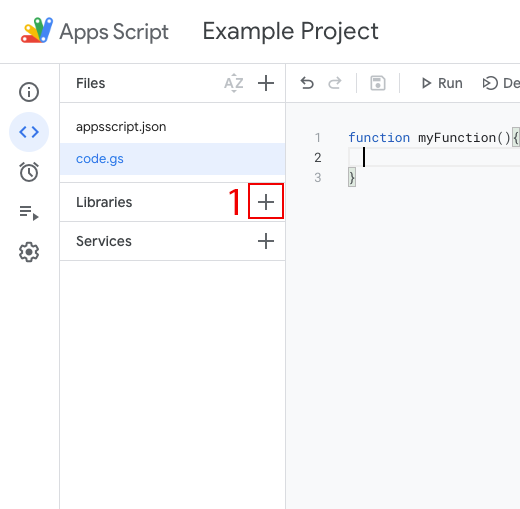
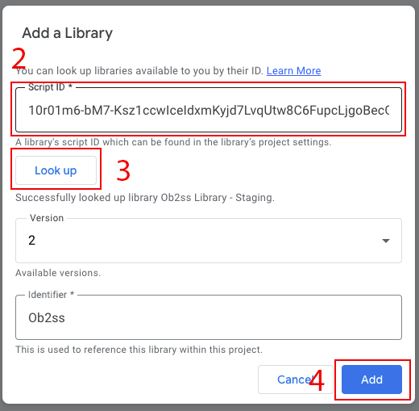

# Ob2SS: The Google Sheets Database
Ob2SS (**Ob**ject **To** **S**pread**S**heet) is an Apps Script library that lets you use a Google Spreadsheet as a
database for your small projects. There's no setup required, works on any JavaScript object, and lets you create hybrid
spreadsheet applications more easily.

Features include:
1. **Well documented** - no one can be expected to memorize how every interface works. Ob2ss has documentation here, on
   the [project website](http://ob2ss.com), and directly in the Apps Script IDE via JSDocs!
2. **Robust** - does exactly what it says in the documentation.
3. **Speed** - the library implements caching to make your calls speedy and efficient.
4. **Simplicity** - you can get started without writing a single line of initialization! Or you can open existing
   spreadsheets to read and write data you already have.

---

This documentation is just a quick start guide and documentation on maintaining the library.  I highly recommend you visit the [project website](http://ob2ss.com) for implementation details, caveats, and examples.

http://ob2ss.com

## Quickstart Guide

To start using Ob2ss right away, you can add it as a library to your project.  Here's the library ID:

```
10r01m6-bM7-Ksz1ccwIceIdxmKyjd7LvqUtw8C6FupcLjgoBecG_Q2dv
```

Add Libraries to your project through the "Libraries" pane.





And you're done! Now you can start calling Ob2ss from your project.


## Downloading, Building, Maintaining

This is a relatively large Apps Script project, so we use node and webpack.

Get set up by cloning the project to your local directory, then install dependencies with `npm install`.

Review `package.json` to see the build commands, but:
1. `push-staging` will push files mostly as-is to a project. This facilitates debugging.
2. `push-production` will compile to the API and push the compiled version to where the library is hosted.

**Important Notes**:
1. Please keep comments synchronized between `api.js` and `Ob2ss.ts`. Optionally with `Table.ts` and
   `SheetUtilities.ts`, too.
2. Use Jest tests for local testing away from the Apps Script ecosystem.
3. Use QUnit for testing in Apps Script for end-to-end that requires interacting with Apps Script globals.


`api.ts` is responsible for exposing library functionality and documentation. No real code should be happening in there.
This pattern is necessary because Apps Script Libraries can only expose documentation from top level functions. It's
cleaner this way.

`Backend.ts` defines an object responsible for (a) capturing and routing incoming calls and (b) managing which
spreadsheet and sheet to write to.

`SheetWrapper.ts` defines a wrapper to a single Spreadsheet `sheet` that orchestrates reading and writing.

`SheetUtilities.ts` defines a utility class with almost all read and write functions relating to Spreadsheets.

`ObjectUtilities.ts` defines a utility class with object transforms like obj=>row and the reverse.

You need two `.claspignore` files and two `.clasp.json` files. This is how we manage deployments because Clasp won't let
you specify targets and we want to keep code and tests together in the same project and repo.

1. The `production` naming convention is for deploying to the library itself for public use.
2. The `staging` naming convention is for staging and testing to another Apps Script project that runs QUnit tests.

Remember, there're two kinds of tests here. Jest tests live alongside the source code and run small, local tests during development
while QUnit tests are in the `testing` directory and run end-to-end, server-side tests in staging when you're close to
deployment.

Strongly recommended that you use the Lock Service in your code if you expect multiple users or concurrent actions.
Ob2ss doesn't do it for you to stay simple and avoid adding in lots of configurables.

Ob2ss uses some caching to make sequential calls faster. No you can't turn it off. If you're worried about invalidation
that badly, you should be using a real database and not some spreadsheet. Just try not to have too many concurrent human
_and_ automatic users.

---

`Options` are mostly plumbed through. There're lots of configurables that haven't been fully integrated, but we might
need space for some day. e.g. header offset.

Columns can shift over time, but not right now. Keep this in mind as you write functions and avoid
direct cell references in your formulas if you can avoid it.

Columns are always added "after" and inherit their formatting that way. But, in general, you should be importing table
data to other sheets for display.

Ob2ss likes tight sheets. Remove empty columns and empty rows for improved accuracy and speed.

An index is a position in the array of all objects in the sheet.

Going from JS => Sheets => JS has weird implications.

0. Avoid blanks in general. Try to avoid writing emptiness.
1. Sheets has only one way of conveying emptiness- a blank cell. So from a JS perspective that means `null` ==
   `undefined` == `{}` == `''`. All 4 of these values in an object are converted to an empty string. If you write a new object with an empty value?
   Nothing is written. If you update an obj with an empty string where there was content before? That overwrites with
   blank content. If you try to read it back, it won't appear in the resulting object. Write explicit data where you
   can.
2. Arrays are trimmed by defaut. Maybe I'll add an option around that later, but for now that means if you write `[1, 2, , ,
   5]`, the array you get back is `[1, 2, 5]`. You lose the blanks.
